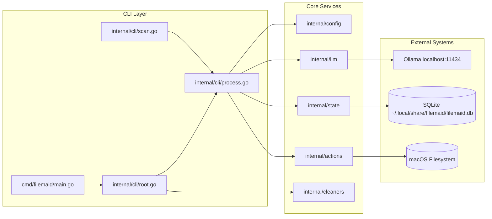
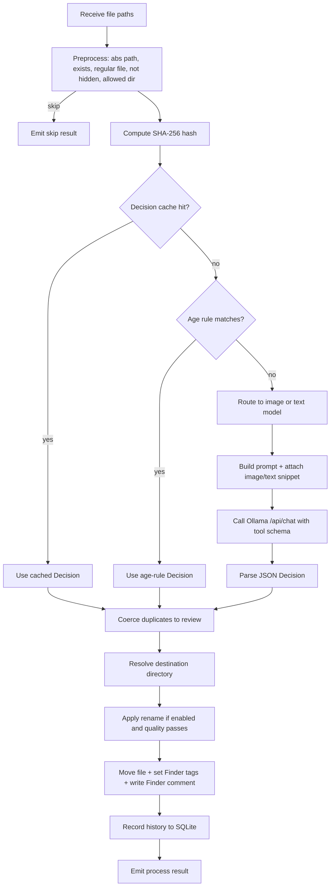
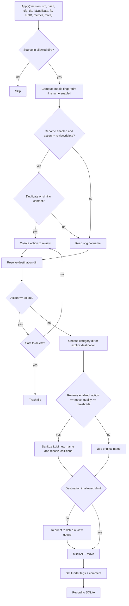
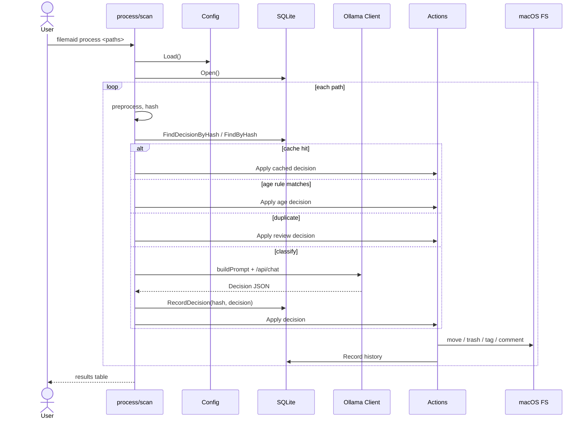

# filemaid Architecture

This document describes how filemaid classifies and organizes files. It is intended for contributors and future maintainers.

## Overview

filemaid is a local, macOS-only file organizer. It is a synchronous, procedural Go CLI that uses a local Ollama LLM to classify files dropped on `~/Desktop` or `~/Downloads`, then moves them into categorized archive folders, applies Finder tags, and quarantines uncertain items for review.

The architecture is intentionally small and direct: a Cobra CLI loads config, opens a SQLite history database, and runs a classification pipeline for each input path.



## Classification Pipeline

The `process` command is the main entry point for classification. For each file path, filemaid runs the following pipeline:



### 1. Preprocessing

`internal/cli/process.go:processPaths` normalizes each path and rejects files that are:

- missing or not regular files
- hidden macOS files (e.g., `._*` or `.DS_Store`)
- outside `cfg.AllowedDirs`

Allowed dirs are a safety boundary used again when validating the final destination.

### 2. Hashing and Caching

For each accepted file, filemaid computes a SHA-256 hash (`internal/actions/actions.go:ComputeHash`). The hash is used for:

- **Decision cache**: `state.FindDecisionByHash` returns a previous LLM decision so identical files skip another round-trip.
- **Duplicate detection**: `state.FindByHash` and `state.FindDuplicatesByHash` detect files already processed with the same content.

The decision cache is keyed by content hash, not path, so renaming or moving a file does not trigger re-classification.

### 3. Age Rules

`internal/cli/process.go:checkAgeRule` evaluates `cfg.AgeRules`. Each rule is a glob pattern plus a minimum age in days and an action. If a file matches and is older than the threshold, the rule's action is used as the decision without calling the LLM.

Age rules take precedence over the decision cache.

### 4. Duplicate Handling

Before calling the LLM, filemaid checks whether the file is a duplicate:

- The current batch tracks seen hashes in memory.
- The SQLite history is queried for prior records with the same hash whose `FinalPath` still exists.

If a duplicate is detected and it is **not** safe to delete (i.e., it does not match `safe_delete_patterns`), the action is coerced to `review` with reason `duplicate detected`. Safe-delete duplicates may be promoted to `delete`.

### 5. Model Routing

`internal/cli/process.go:modelForPath` routes files to one of three configured models:

- `ImageModel` for files with image extensions (jpeg, png, heic, etc.)
- `TextModel` for text-readable files (txt, pdf, md, code, etc.)
- `Model` as the fallback when a specific model is not configured

This lets heavy vision models handle photos while lightweight models handle documents.

### 6. Prompt Construction

`internal/llm/llm.go:buildPrompt` builds the user message sent to Ollama. It includes:

- the configured category list
- action guidance (`move`/`delete`/`review`)
- file metadata: absolute path, basename, extension, size, modification time
- for images: a resized base64-encoded JPEG attachment
- for text files: the first 2048 bytes of content

The full system behavior is encoded in the embedded Modelfiles (`internal/setup/assets/modelfiles/`), while the per-request user message carries dynamic file data.

### 7. LLM Call and Tool Schema

filemaid uses Ollama's `/api/chat` endpoint and supplies a `classify_file` tool schema:

```json
{
  "name": "classify_file",
  "parameters": {
    "type": "object",
    "properties": {
      "category":    { "type": "string", "enum": ["Images", "Documents", ...] },
      "subcategory": { "type": "string" },
      "tags":        { "type": "array", "items": { "type": "string" } },
      "action":      { "type": "string", "enum": ["move", "delete", "review"] },
      "reason":      { "type": "string" },
      "new_name":    { "type": "string" },
      "name_quality":{ "type": "integer", "minimum": 1, "maximum": 5 }
    },
    "required": ["category", "tags", "action", "reason"]
  }
}
```

`internal/llm/llm.go:requestChat` sends the message; `parseResponse` extracts the tool-call arguments and builds a `llm.Decision`.

### 8. The Decision Value Object

The shared output of classification is `llm.Decision`:

```go
type Decision struct {
    Category    string   // e.g., "Images", "Documents"
    Subcategory string   // e.g., "car", "receipt"
    Tags        []string // Finder tags to apply
    Action      string   // "move" | "delete" | "review"
    Destination string   // optional explicit destination
    Reason      string   // human-readable explanation
    NewName     string   // LLM-suggested filename
    NameQuality int      // 1-5; 0 means no suggestion
}
```

If parsing fails or Ollama errors, `llm.NewDecision` returns a safe default: `Category: "Unknown"`, `Action: "review"`.

## Applying a Decision

`internal/actions/actions.go:Apply` carries out a decision. It is the only place files are moved, tagged, or trashed.



### Destination Resolution

`Apply` resolves the destination directory in this order:

1. If `action == "review"`, use `cfg.ReviewDir/<date>/`.
2. If `decision.Destination` is set, use its directory.
3. If `decision.Category` maps to a directory in `cfg.Categories`, use that directory.
4. Otherwise, fall back to the review queue.

### Rename Safety

Rename only happens when all of the following are true:

- `cfg.Rename == true`
- `decision.Action == "move"`
- `decision.NameQuality >= cfg.RenameLevel`
- fingerprint computation succeeded
- the file is not a duplicate or near-duplicate

The candidate `NewName` is sanitized by `internal/actions/actions.go:sanitizeName`:

- preserves the original extension
- strips invalid characters
- enforces `cfg.RenameMinLength` and `cfg.RenameMaxLength`
- falls back to the original name if the result is too short or invalid

Name collisions are resolved with a counter suffix (`uniqueNameWithCounter`).

### Safety Rules

`Apply` enforces several fail-safes:

- **Allowed directory boundary**: source and destination must be inside `cfg.AllowedDirs`.
- **Delete safety**: `action == "delete"` is honored only for files matching `safe_delete_patterns` or when the file is a duplicate.
- **Trash failure**: if `osascript` trash fails, the action is coerced to `review`.
- **Concurrent move**: if the source disappears during processing, the file is reported as skipped.

## State and History

`internal/state/state.go` persists every processed file to SQLite. The `history` table records:

- original and final paths
- SHA-256 hash
- category, tags, action, reason
- LLM metrics (duration, tokens, context size)
- original and new filenames
- media fingerprint components

This history enables duplicate detection, similar-image detection, and the decision cache.

## Image and Media Fingerprinting

When rename is enabled, `internal/fingerprint/fingerprint.go` computes a `MediaFingerprint` for supported files:

- **Images**: perceptual hash via `goimagehash`
- **Audio/Video**: optional AV signature via `ffmpeg` when `rename_use_ffmpeg` is true
- **Text**: text signature

`actions.Apply` queries `state.FindSimilarByFingerprints` and compares scores with `fingerprint.CompareFiles`. Scores above `cfg.RenameImageSimilarityThreshold` (or `cfg.RenameAVSimilarityThreshold` for AV files) coerce the action to `review` to avoid renaming near-duplicates.

## Scan Command

`internal/cli/scan.go` discovers files in `cfg.WatchDirs` and forwards them to the same `processPaths` pipeline used by `process`. It supports `--dir` to override watch directories and `--dry-run` to preview outcomes without side effects.

## Cleaners

`internal/cleaners/registry.go` exposes a `CLEANERS` registry of modules for removing stale development artifacts and old review-queue items. Each cleaner implements:

```go
func CanRun() bool
func Run(dryRun bool, cfg *config.Config) CleanupResult
```

Only cleaners listed in `cfg.AllowedCleaners` may run.

## Data Flow Summary



## Key Files

| File | Responsibility |
|------|----------------|
| `cmd/filemaid/main.go` | CLI entry point |
| `internal/cli/root.go` | Cobra root command, persistent pre-run |
| `internal/cli/process.go` | Classification pipeline orchestration |
| `internal/cli/scan.go` | Watch-directory scan wrapper |
| `internal/llm/llm.go` | Ollama client, prompt building, JSON parsing |
| `internal/actions/actions.go` | Apply decisions, move/tag/trash/review |
| `internal/actions/fs.go` | FS abstraction for real macOS and test doubles |
| `internal/state/state.go` | SQLite history, decisions, duplicates, similarity |
| `internal/config/config.go` | Typed config, defaults, merge logic |
| `internal/fingerprint/fingerprint.go` | Perceptual and content fingerprints |
| `internal/cleaners/registry.go` | Cleaner plugin registry |
