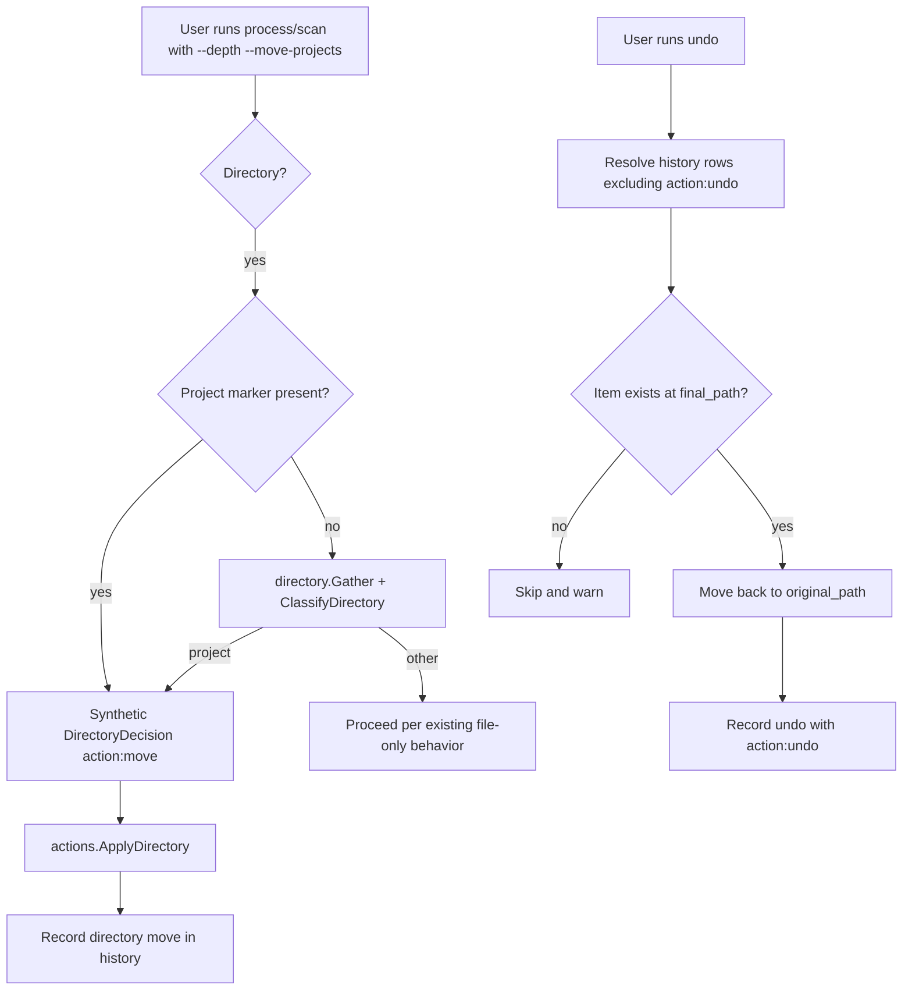

# feat: Project directory atomicity and undo

## Summary

Extend filemaid's directory-aware scanning so cohesive project directories are moved as atomic units rather than having their files dispersed. Recognition uses marker files first and falls back to LLM directory evidence. Recognized project directories move whole to the review queue by default, or to a configured category when a project-directory category is configured. This plan supersedes the read-only directory boundary in `docs/plans/2026-06-22-002-feat-directory-aware-deep-classification-plan.md` by adding an opt-in `--move-projects` flag that enables whole-directory moves. Add an `undo` command that restores files and directories to their original paths and names using the history database.

## Problem Frame

A recent `filemaid process` run treated `~/Downloads/Kimi_Agent_Marc's Radar-revised/` as a collection of individual files. The folder contained markdown sections (`marcsradar_sec00.md` through `sec08.md`), cross-reference files (`marcsradar_ref.md`), review files, rendered images, and generated Word documents that only make sense when kept together. filemaid moved many of those files into `~/.filemaid/review/` and the archive, breaking the working directory. The existing `--depth` feature is read-only and built around dev project markers; it does not protect non-dev project folders, and there is no way to reverse a mistaken move.

## Requirements Traceability

| Requirement | Addressed by |
|-------------|--------------|
| R1–R5 Project directory recognition | U1, U4 |
| R6–R10 Project directory action | U3, U4, U6 |
| R11–R16 Undo / restore | U5 |
| R17–R19 Compatibility and safety | U3, U4, U5, U7, U8 |

## Key Technical Decisions

- **Opt-in destructive behavior.** Whole-directory moves only happen when the user passes `--move-projects` (for `process` and `scan`). Without the flag, `--depth` retains its existing read-only directory-analysis behavior.
- **Marker-first recognition, LLM fallback.** Directories with `project_markers` are treated as project directories immediately. Directories without markers are inspected by the existing `directory.Gather` + `ClassifyDirectory` path, with richer prompt evidence added.
- **Single `DirectoryDecision` for all directory fates.** The existing `keep|review|trash|archive` recommendation is extended with optional `action` and `destination` fields so the same type can express "move this whole directory to review" or "move this whole directory to the Projects category."
- **Whole-directory move is atomic-when-possible.** Same-volume moves use a single `os.Rename`, which is atomic. Cross-device moves fall back to recursive copy+remove and are documented as non-atomic.
- **Undo restores to `original_path`.** In the existing schema, `original_path` already encodes the full pre-move path including the original filename. Undo moves the item from `final_path` back to `original_path`.
- **Undo rows are distinguishable.** Undo operations record a history row with `action: "undo"`. Undo candidate selection excludes rows whose `action` is `undo` to prevent ping-pong restores.
- **Trashed items are not restorable.** Records whose `final_path` is `trash` are skipped by undo because macOS Trash restoration is not reliable enough.

## High-Level Technical Design

## Implementation Units

### U1. Extend DirectoryDecision and directory prompt

**Goal:** Allow directory classification to recommend moving a whole directory to a destination.

**Requirements:** R1, R2, R4

**Dependencies:** None

**Files:**
- `internal/llm/llm.go`
- `internal/directory/metadata.go`

**Approach:**
- Extend `DirectoryDecision` with `Action string` and `Destination string` fields.
- Update `directoryToolSchema` to include `action` and `destination` as optional properties.
- Update the directory prompt template to request `action` (`move`) and `destination` when the recommendation is `review` or `archive`. Keep `keep` and `trash` unchanged.
- When `Destination` is empty and `Action` is `move`, the caller resolves the destination (review queue or configured category).
- Update `directoryCacheKey` to include config-derived inputs (`ProjectDirCategory`, `ProjectMarkers`) rather than outputs, so config changes invalidate stale cache entries.
- Add representative text snippets to `directory.Metadata` so the prompt can see cross-references between files. Gather snippets from up to `N` text files, capped by bytes.

**Patterns to follow:**
- Existing `DirectoryDecision{Recommendation, Reason, Category, Tags}` shape.
- Existing `directoryToolSchema`, `buildDirectoryPrompt`, and `parseDirectoryResponse` wiring.

**Test scenarios:**
- `DirectoryDecision` JSON with `action: "move"` and `destination: ""` parses correctly.
- Directory without markers but with LaTeX/markdown files returns `action: move`.
- `keep` and `trash` decisions have empty `Action`.
- Cache key changes when `ProjectDirCategory` changes for the same metadata.

**Verification:** Directory classifier unit tests pass; prompt changes do not break existing `keep|review|trash|archive` decisions.

---

### U2. Add project-directory category configuration

**Goal:** Let users configure a destination category for recognized project directories.

**Requirements:** R8

**Dependencies:** U1

**Files:**
- `internal/config/config.go`
- `internal/setup/assets/config.json`

**Approach:**
- Add `ProjectDirCategory string` to `Config` with default `""`.
- Destination resolution order for a directory with `Action == "move"`: `decision.Destination` > `cfg.Categories[cfg.ProjectDirCategory]` > dated review queue.
- Document the option in the shipped `config.json` as a commented example.

**Patterns to follow:**
- Existing category resolution in `actions.Apply`.
- Existing additive merge for `ProjectMarkers`.

**Test scenarios:**
- `ProjectDirCategory` set to a valid category moves the directory there.
- `ProjectDirCategory` set to a missing category falls back to review.
- Empty `ProjectDirCategory` always falls back to review.

**Verification:** Config load/merge tests pass; destination resolution tests pass.

---

### U3. Implement whole-directory move in actions package

**Goal:** Provide a safe, atomic-when-possible move primitive for project directories.

**Requirements:** R6, R7, R8, R9, R18

**Dependencies:** U1, U2

**Files:**
- `internal/actions/actions.go`
- `internal/actions/fs.go`

**Approach:**
- Add `ApplyDirectory(decision DirectoryDecision, src string, cfg *config.Config, db state.Repo, fs FS, runID string) (string, error)`.
- Resolve destination using the precedence in U2.
- Enforce `allowed_dirs` on both source and destination; redirect to review if destination is outside allowed dirs.
- Attempt `fs.Move(src, dest)` first. If it fails due to a cross-device error, fall back to recursive copy+remove. Implement the recursive fallback as a new helper in `internal/actions/fs.go` because the existing `OSFS.Move` file fallback does not handle directories.
- Record a single history row with `original_path`, `final_path`, `original_name`, and `new_name` for the directory.
- Apply Finder tags/comments to the directory if `cfg.Tags` / `cfg.Comments` are enabled.

**Patterns to follow:**
- Existing `Apply` safety gates (`WithinAllowed`, `datedReviewPath`, `UniqueDest`).
- Existing `OSFS.Move` behavior.

**Test scenarios:**
- Same-volume move succeeds and records history.
- Destination outside `allowed_dirs` redirects to review.
- Cross-device fallback copies all children and removes the source.
- Hidden or disallowed source is skipped.

**Verification:** `actions` package tests pass with `RecordingFS` and `FakeRepo`.

---

### U4. Wire project-directory atomic moves into process and scan

**Goal:** Recognize and act on project directories during `process` and `scan`.

**Requirements:** R1–R10, R17, R18

**Dependencies:** U1, U2, U3

**Files:**
- `internal/cli/process.go`
- `internal/cli/scan.go`

**Approach:**
- Add a boolean `--move-projects` flag to both `process` and `scan`. Without it, directory arguments produce read-only recommendations as today.
- When `--move-projects` is set and a directory argument is encountered:
  1. Check for project markers via `directory.Gather`.
  2. If markers found, synthesize `DirectoryDecision{Recommendation: "archive", Action: "move", Destination: ""}` and call `actions.ApplyDirectory`.
  3. If no markers, call `classifyDirectory` and apply a `move` recommendation via `ApplyDirectory`.
- When descending into directories, classify directories before collecting their child files. Drop any file candidates whose ancestor is a project directory.
- In `scan`, when a watched directory contains a project subdirectory, treat the subdirectory as a single candidate and move it whole when `--move-projects` is set.
- Update `processResult` to carry `Kind: "directory"` and the new `Result` path for directory moves.

**Patterns to follow:**
- Existing `classifyDirectory` call in `processPaths`.
- Existing `dirLockMap` serialization; acquire a lock on the destination directory before `ApplyDirectory`.

**Test scenarios:**
- `--move-projects` moves a directory with markers as a whole; no child files are processed.
- `--move-projects` moves a directory classified as project by LLM as a whole.
- Without `--move-projects`, directory behavior remains read-only.
- Existing file-only behavior is unchanged when `--depth` is absent or the directory is not a project.
- Guardrails (hidden, `allowed_dirs`, `min_age_hours`) still apply to the directory.

**Verification:** `process` and `scan` unit tests pass; integration test with a synthetic project directory passes.

---

### U5. Add undo command

**Goal:** Reverse filemaid moves and renames from history.

**Requirements:** R11–R16, R19

**Dependencies:** None (uses existing history schema)

**Files:**
- `internal/cli/undo.go`
- `internal/cli/root.go`
- `internal/state/state.go`

**Approach:**
- Add `undo` command with flags `--last`, `--run`, positional path argument, `--force`, and `--dry-run`.
- Query history rows, excluding rows whose `action` is `undo`:
  - `--last` → most recent distinct `run_id` with move actions.
  - `--run <id>` → all rows for that run.
  - positional path → most recent row where `final_path` matches.
- For each row:
  1. Skip if `final_path == "trash"` or `action == "undo"`.
  2. Verify the item exists at `final_path`.
  3. Compute restore destination as `original_path` (which already encodes the original name).
  4. Verify the restore destination is inside `cfg.AllowedDirs`.
  5. If destination exists and `--force` is not set, skip and warn.
  6. Move `final_path` to restore destination.
  7. Record a new history row with `action: "undo"` documenting the restore.
- `--dry-run` previews restores without moving files or recording history.

**Patterns to follow:**
- Existing `history` command query patterns.
- Existing `actions.OSFS` for moves.
- Existing `allowed_dirs` enforcement.

**Test scenarios:**
- `undo --last` restores all moves from the previous run.
- `undo --run <id>` restores moves from a specific run.
- `undo <final_path>` restores a single item.
- Rename is reversed: the file returns to `original_path`.
- `undo --last` after an undo does not re-undo the undo rows.
- Collision without `--force` is skipped.
- Collision with `--force` overwrites.
- Trashed items are skipped.
- Destination outside `allowed_dirs` is refused.
- `--dry-run` reports moves without mutating the filesystem or history.

**Verification:** Undo unit tests pass; integration test restores a moved and renamed file.

---

### U6. Update output formatters for directory moves

**Goal:** Make project-directory moves clearly distinguishable from file moves in all output formats.

**Requirements:** R10

**Dependencies:** U4

**Files:**
- `internal/cli/process.go`
- `internal/cli/scan.go`

**Approach:**
- For directory rows, show `dir:` prefix and the final destination in the `Result` column.
- For directory rows, use `Action: "move"` and `Kind: "directory"`.
- Update JSON, table, and human-readable formatters to handle directory rows.
- Keep file rows unchanged.

**Patterns to follow:**
- Existing `processResult` and `formatProcessResults`.

**Test scenarios:**
- Table output shows directory rows with `dir:` prefix.
- JSON output includes `kind: "directory"` and `result` path.
- Human-readable output mentions "moved directory" and the destination.

**Verification:** Formatter tests pass; sample output matches expected strings.

---

### U7. Unit tests for directory moves and undo

**Goal:** Cover new logic at the package level.

**Requirements:** R1–R19

**Dependencies:** U1–U6

**Files:**
- `internal/actions/actions_test.go`
- `internal/llm/llm_test.go`
- `internal/cli/undo_test.go`
- `internal/cli/process_test.go`

**Approach:**
- Add `ApplyDirectory` tests using `RecordingFS` and `FakeRepo`.
- Add `ClassifyDirectory` tests for the new `action`/`destination` response shape.
- Add `undo` command tests using a populated `FakeRepo`.
- Extend `process` tests to cover `--move-projects` and project-directory argument handling.

**Test scenarios:**
- Happy path: project directory moved to review and recorded.
- Undo happy path: moved file restored to original path.
- Undo edge cases: collision, missing source, trash record, outside allowed dirs, re-undo prevention.
- Directory prompt correctly parses new JSON fields.

**Verification:** `go test ./...` passes at the package level.

---

### U8. Integration tests and dry-run coverage

**Goal:** Verify end-to-end behavior with real filesystem operations.

**Requirements:** R10, R16, R17

**Dependencies:** U1–U7

**Files:**
- `internal/cli/integration_test.go`

**Approach:**
- Add integration tests that create a temporary project directory, run `process --depth --move-projects`, assert the directory moved whole, then run `undo --last` and assert it is restored.
- Cover `--dry-run` for both forward moves and undo: no filesystem changes, history rows previewed or not recorded.
- Cover non-project directories to confirm file-only behavior is unchanged.

**Test scenarios:**
- Markdown/LaTeX project folder is moved whole and restored.
- `--dry-run process --depth --move-projects` does not move the directory.
- `--dry-run undo --last` does not restore files.
- Non-project directory still processes individual files when `--depth` is used.

**Verification:** Integration tests pass on macOS; dry-run tests leave the filesystem unchanged.

## Scope Boundaries

### In scope
- Project-directory recognition via markers and LLM evidence.
- Whole-directory moves as atomic-when-possible units.
- Undo command for moved and renamed files and directories.
- Output formatting updates for directory moves.
- Unit and integration tests.

### Deferred for later
- Recursive detection of nested project directories.
- Auto-creating project marker files for users.
- Extracting and archiving contents of project directories.
- Synchronizing Finder tags across directory moves.

### Outside this product's identity
- Cloud-based snapshots, versioning, or a generalized filesystem time machine.
- Reliable restoration of trashed items from macOS Trash.

## Open Questions

### Resolved during planning
- **Q: Should undo have its own table?** A: No — reuse `history`; record the undo as a row with `action: "undo"`.
- **Q: How are cross-device directory moves handled?** A: Fall back to recursive copy+remove; document the non-atomic risk.
- **Q: Should `--depth` become destructive by default?** A: No — add an opt-in `--move-projects` flag so existing read-only `--depth` behavior is preserved.
- **Q: How is re-undo prevented?** A: Exclude rows with `action: "undo"` from undo candidate selection.

### Deferred to implementation
- **Q:** What exact prompt text produces the most reliable project-vs-junk classification for non-dev directories?
- **Q:** What should the default `ProjectDirCategory` key be named in config, and should it be added to the default `config.json` commented out?
- **Q:** Should undo record the inverse row with the original `run_id` or a new undo-specific `run_id`?

## Risks & Dependencies

| Risk | Impact | Mitigation |
|------|--------|------------|
| Cross-device directory move is not atomic | Partial directory state on failure | Implement recursive copy+remove fallback; document risk; consider pre-flight size check. |
| LLM misclassifies a non-project as project | User loses expected per-file behavior | Default destination is review queue, not archive; `--move-projects` is opt-in. |
| Undo collides with files created after the move | Data loss if `--force` is used | Skip by default; require `--force` to overwrite; warn clearly. |
| Large project directories move slowly | Poor UX on big trees | Same-volume `os.Rename` is fast; cross-device large moves are inherently slow. |
| Existing `--depth` behavior changes | User surprise | Keep read-only behavior as default; whole-directory moves require `--move-projects`. |

## Sources & Research

- Origin requirements: `docs/brainstorms/2026-06-23-project-directory-atomicity-and-undo-requirements.md`
- Existing directory-aware plan: `docs/plans/2026-06-22-002-feat-directory-aware-deep-classification-plan.md`
- Key files: `internal/cli/process.go`, `internal/cli/scan.go`, `internal/actions/actions.go`, `internal/state/state.go`, `internal/llm/llm.go`, `internal/directory/metadata.go`
- Verified claims:
  - History records `original_path`, `final_path`, `original_name`, `new_name` (`internal/state/state.go:34-45`, `internal/actions/actions.go:282-293`). `original_path` is the full pre-move path.
  - No undo/revert/restore command exists (codebase search).
  - Directory-aware scanning is partially implemented via `--depth`, `project_markers`, `internal/directory.Gather`, and `DirectoryDecision` (`internal/cli/process.go:148`, `internal/config/config.go:82`, `internal/llm/llm.go:86-102`).
  - Default project markers are `.git`, `node_modules`, `.venv`, `vendor`, `.terraform`, `build` (`internal/config/config.go:168`).
